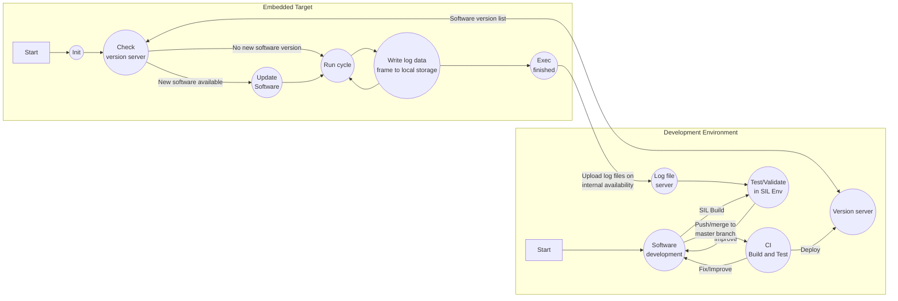
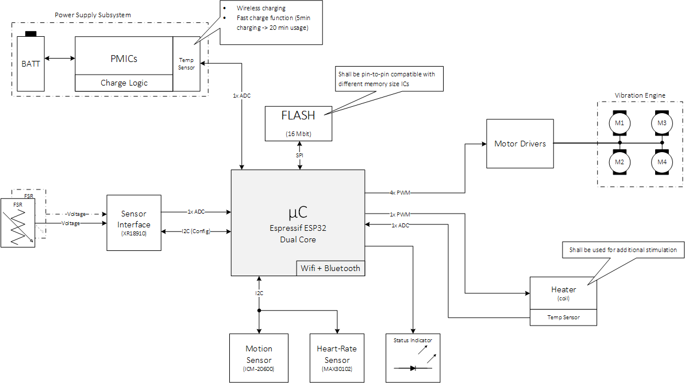
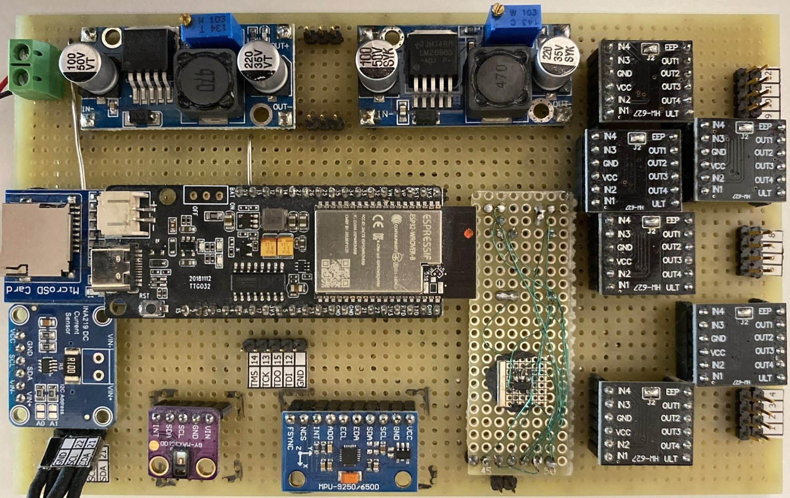
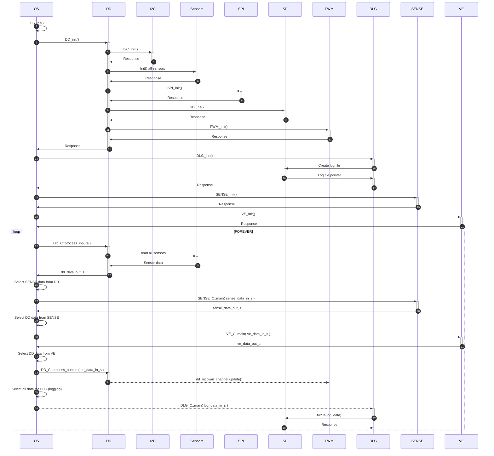

- [Introduction](#introduction)
- [System Architecture](#system-architecture)
  - [Development Board](#development-board)
- [Software Architecture](#software-architecture)
  - [Source Code Structure](#source-code-structure)
  - [Data Structure Layout](#data-structure-layout)
- [Simulation Environment Architecture](#simulation-environment-architecture)
  - [Log File Creation](#log-file-creation)

# Introduction
This project was created in order to get a better understanding of DevOps and how a tool chain could be setup to actualize a automated development cycle with an embedded IoT targets.

The following list as well as the flow chart below describe the basic conceptional idea as follows:

1. Development Environment
   1. Develop on host PC
   2. Build to be used within SIL environment
   3. Test/Debug within SIL environment using log-files from server
   4. If SIL test successful, push code to master branch
   5. CI pipeline is automatically triggered
   6. If CI pipeline fails, go back to 3, else continue
   7. Once all changes have been committed and tested, created version tag
   8. New version is automatically deployed onto version server
2. Embedded Target
   1. Started embedded device
   2. After device initialization, check version server (1.8) for new version
   3. Update version to latest one if available, else continue
   4. Write log-file to local storage containing new version number
   5. Close log-file at the end of the session and Upload to remote log-file server once internet is available

With this approach it'll will be analyzed if the software can be continuously improved by deploying it into the field after every major release and by analyzing the log-files that are generated by every user after every usage.



The following video shall give an first impression about the SIL (resimulation) environment. Signal can be represented as numerical or type values within value windows or in graphical format within plot windows.

<p align="center"></p>

# System Architecture
The overall [system architecture](/documents/system_architecture.pdf) is shown in the block diagram below. The system central component is an ESP32 low-cost, low-power system on a chip microcontrollers with integrated Wi-Fi and dual-mode Bluetooth in an 6x6mm Quad Flat No Leads Package (QFN). The system contains a high-resolution FSR (Force Sensitive Resister) front-end to be able to sense touch input given by the user. In addition, in contains a number of sensors like the ICM-20600 6-axis motion sensor and the MAX30102 heart-rate sensor. Haptic feedback can be given the the user using the vibration engine on the right. FUrthermore, FLASH memory has been added to pride the ability to store large chunks of data locally. It is planted to power the system by an rechargeable battery that'll be embedded into the local power management system.

<p align="center"></p>

## Development Board
For initial proof-of-concept studies and device driver development, a development board has been created as shown below.

__Note: The local power supply subsystem is not yet part of the development system.__


<p align="center"></p>


# Software Architecture
In this project, a data-flow driven software architecture has been implemented to enable that the application can be resimulated using a SIL environment in conjunction with a log file that has been recorded by the embedded target.





## Source Code Structure
1. [[OS] Operating System Domain](/software/construction/MainApplication/OS)
2. [[DD] Device Driver Domain](/software/construction/MainApplication/DD)
3. [[SENSE] Sensor Processing Domain](/software/construction/MainApplication/SENSE)
4. [[VE] Vibration Engine Domain](/software/construction/MainApplication/VE)
5. [[DLG] Data Logging Domain](/software/construction/MainApplication/DLG)
6. [[UTIL] Utility Domain](/software/construction/MainApplication/UTIL)

## Data Structure Layout


```C
typedef struct DD_DATA_OUT_TYPE_TAG
{
    const DD_I2C_ERROR_DATA_TYPE*     p_i2c_error_out_s;      /**< @details Pointer to I2C error data structure */
    const DD_ADC_DATA_OUT_TYPE*       p_adc_data_out_s;       /**< @details Pointer to ADC output data structure */
    const DD_INA_219_DATA_OUT_TYPE*   p_ina_219_data_out_s;   /**< @details Pointer to INA-219 output data structure */
    const DD_TMP_102_DATA_OUT_TYPE*   p_tmp_102_data_out_s;   /**< @details Pointer to TMP-102 output data structure */
    const DD_ICM_20600_DATA_OUT_TYPE* p_icm_20600_data_out_s; /**< @details Pointer to ICN-20600 output data structure */
    const DD_MAX_30102_DATA_OUT_TYPE* p_max_30102_data_out_s; /**< @details Pointer to MAX-30102 output data structure */
} DD_DATA_OUT_TYPE;
```

```C
typedef struct DD_ICM_20600_DATA_OUT_TYPE_TAG
{
    U8                 device_id_u8;                                         /**< @details Unique device id */
    F32                temperature_deg_f32;                                  /**< @details Internal core (die) temperature @unit °C */
    U16                temperature_raw_u16;                                  /**< @details Internal core (die) temperature raw @unit LSB */
    DD_ICM_20600_AFS   accel_full_scale_sel_e;                               /**< @details Acceleration scale @unit G */
    DD_ICM_20600_GFS   gyro_full_scale_sel_e;                                /**< @details Gyroscope scale @unit Deg/s */
    F32                accel_resolution_f32;                                 /**< @details Acceleration raw data */
    F32                gyro_resolution_f32;                                  /**< @details Acceleration raw data */
    S16                accel_data_raw_s16[DD_ICM_20600_ACCEL_SIZE];          /**< @details Gyroscope raw data @unit LSB */
    S16                gyro_data_raw_s16[DD_ICM_20600_GYRO_SIZE];            /**< @details Acceleration raw data  @unit LSB */
    U8                 self_test_vu8[DD_ICM_20600_SELF_TEST_SIZE];           /**< @details Self-Test result */
    BOOLEAN            self_test_passed_b;                                   /**< @details Flag to indicate whether the self-test has passed or not */
    BOOLEAN            is_calibrated_b;                                      /**< @details Flag to indicate whether the device is calibrated or not */
    F32                factory_trim_vf32[DD_ICM_20600_SELF_TEST_SIZE];       /**< @details Factory trim values */
    F32                fac_trim_deviation_vf32[DD_ICM_20600_SELF_TEST_SIZE]; /**< @details Deviation from factory trim values */
    DD_ICM_20600_STATE state_e;                                              /**< @details Main device state */
    DD_ICM_20600_ERROR error_e;                                              /**< @details Main error state */
} DD_ICM_20600_DATA_OUT_TYPE;

```

# Simulation Environment Architecture
## Log File Creation
A new log-file is created on each power cycle and is stored on the local SD-Card in binary format. One frame of data is saved at the end of each execution cycle having the format shown in the structure extract below (for full structure layout see [dlg_log.h,](/software/construction/MainApplication/DLG/dlg_log.h) ), line 78-176.

```C
typedef struct DLG_LOG_DATA_IN_TYPE_TAG
{
    F32 dd_icm_20600_temperature_deg_f32;           /**< @details ICM-20600 Internal core (die) temperature @unit °C */
    F32 dd_icm_20600_factory_trim_xa_f32;           /**< @details ICM-20600 XA factory trim value */
    F32 dd_icm_20600_factory_trim_ya_f32;           /**< @details ICM-20600 YA factory trim value */
    F32 dd_icm_20600_factory_trim_za_f32;           /**< @details ICM-20600 ZA factory trim value */
    F32 dd_icm_20600_factory_trim_xg_f32;           /**< @details ICM-20600 XG factory trim value */
    F32 dd_icm_20600_factory_trim_yg_f32;           /**< @details ICM-20600 YG factory trim value */
    F32 dd_icm_20600_factory_trim_zg_f32;           /**< @details ICM-20600 ZG factory trim value */
    F32 dd_icm_20600_factory_trim_dev_xa_f32;       /**< @details ICM-20600 XA factory trim deviation @unit % */
    F32 dd_icm_20600_factory_trim_dev_ya_f32;       /**< @details ICM-20600 YA factory trim deviation @unit % */
    F32 dd_icm_20600_factory_trim_dev_za_f32;       /**< @details ICM-20600 ZA factory trim deviation @unit % */
    F32 dd_icm_20600_factory_trim_dev_xg_f32;       /**< @details ICM-20600 XG factory trim deviation @unit % */
    F32 dd_icm_20600_factory_trim_dev_yg_f32;       /**< @details ICM-20600 YG factory trim deviation @unit % */
    F32 dd_icm_20600_factory_trim_dev_zg_f32;       /**< @details ICM-20600 ZG factory trim deviation @unit % */
    F32 dd_max_30102_temperature_f32;               /**< @details MAX-30102 Internal core (die) temperature @unit °C */
    F32 dd_adc_raw_level_f32;                       /**< @details ADC level where Full-Scale (4095) is mapped to 1.0 and 0 is mapped to 0.0 */
    F32 dd_adc_filtered_level_f32;                  /**< @details Filtered ADC level where Full-Scale (4095) is mapped to 1.0 and 0 is mapped to 0.0 */
    F32 sense_ts_alpha_filtered_adc_level_f32;      /**< @details Alpha filtered ADC level where Full-Scale (4095) is mapped to 1.0 and 0 is mapped to 0.0 */
    F32 sense_ts_alpha_beta_filtered_adc_level_f32; /**< @details Alpha/Beta filtered ADC level where Full-Scale (4095) is mapped to 1.0 and 0 is mapped to 0.0 */
    F32 sense_ts_touch_confidence_f32;              /**< @details Touch confidence with a range of 0.0 to 1.0 */
    F32 sense_ts_touch_confidence_max_f32;          /**< @details Maximum touch confidence with a range of 0.0 to 1.0 °C */
    F32 dd_ina_219_shunt_voltage_mV_f32;            /**< @details Voltage across the shunt resistor @unit mV */
    F32 dd_ina_219_bus_voltage_V_f32;               /**< @details Bus voltage @unit V */

    . . .
  
} DLG_LOG_DATA_IN_TYPE;
```