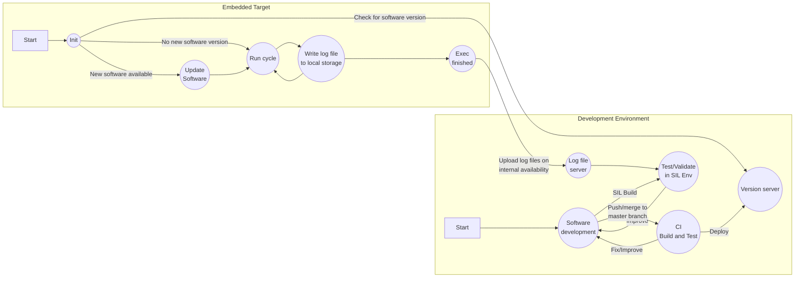

- [Introduction](#introduction)
  - [Full Development Cycle](#full-development-cycle)
- [System Architecture](#system-architecture)
  - [Development Board](#development-board)
- [Software Architecture](#software-architecture)
  - [Source Code Structure](#source-code-structure)
  - [Data structure Layout](#data-structure-layout)
- [Simulation Environment Architecture](#simulation-environment-architecture)

# Introduction

## Full Development Cycle

# System Architecture

## Development Board

# Software Architecture
## Source Code Structure
## Data structure Layout

# Simulation Environment Architecture

